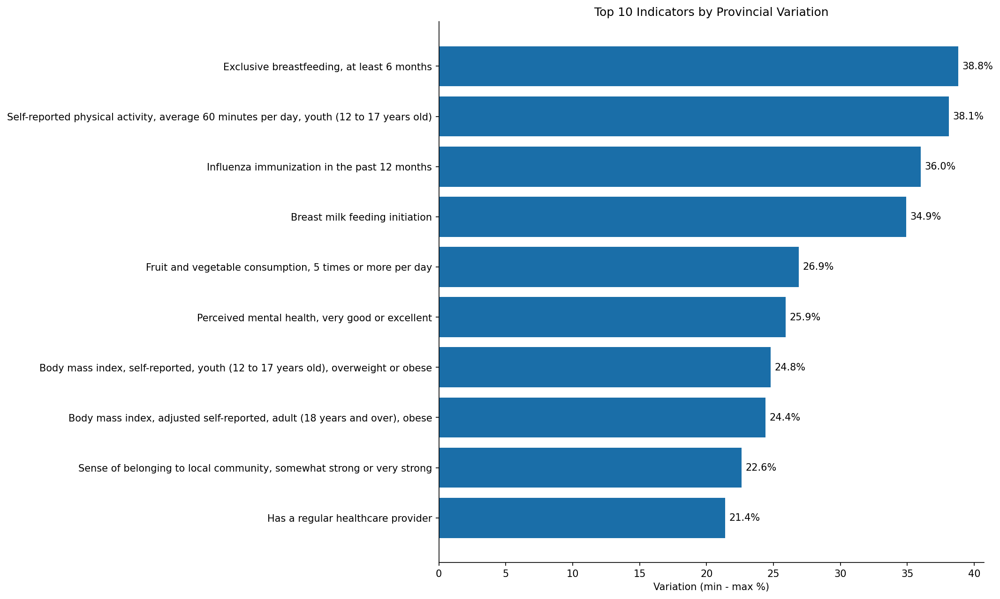
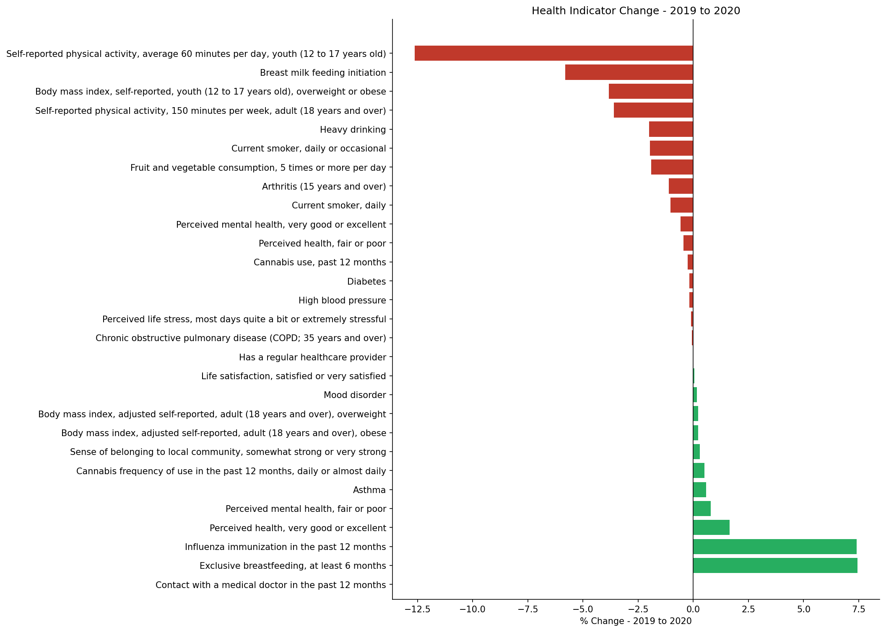
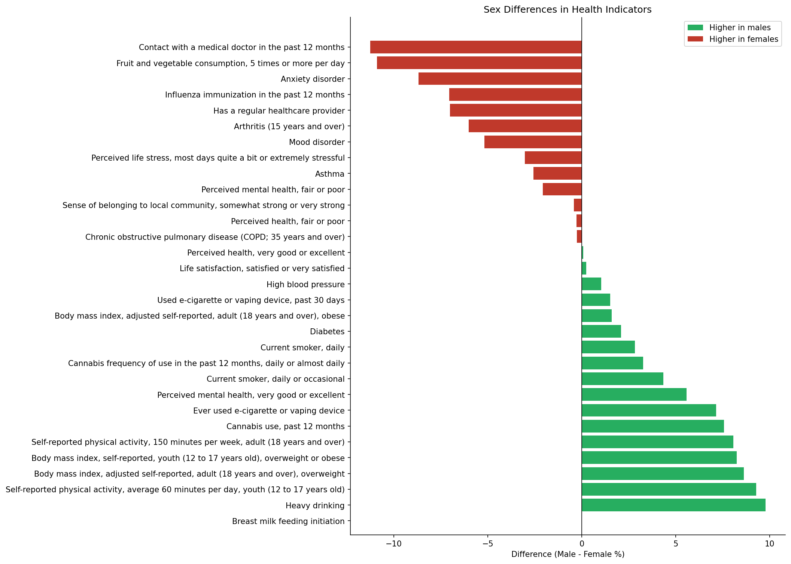
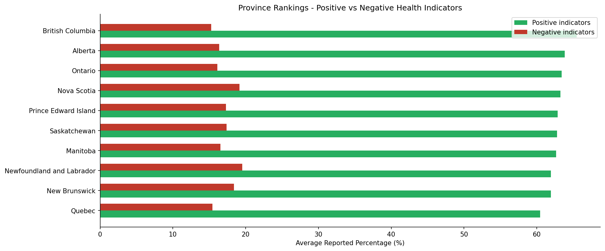
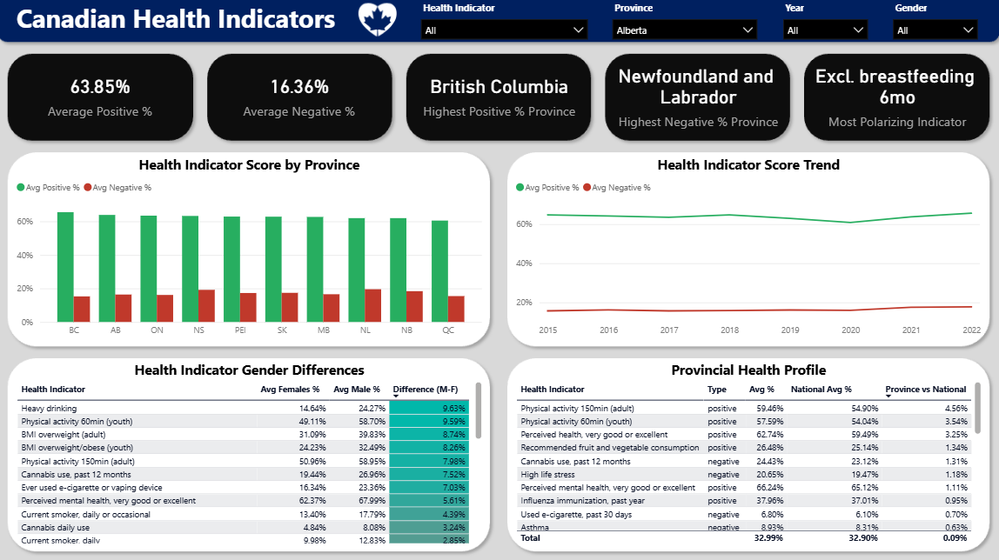

# Canada Health Indicators

This data warehouse and analytics project was built around Canadian health indicator data sourced from Statistics Canada (table 13-10-0096-01), which covers 32 indicators across 10 provinces from 2015 to 2022. Initial EDA focused on four main questions: which indicators vary most across provinces, how COVID-19 impacted health outcomes between 2019 and 2020, whether significant differences exist between male and female health outcomes, and which provinces consistently perform best and worst. The project demonstrates an end-to-end data engineering pipeline built entirely in Microsoft Fabric, from raw data ingestion through medallion architecture to an interactive Power BI dashboard.

---

## Project Overview

This project involves:

1. **Data Extraction**: Pulling the full Statistics Canada health indicator table via direct ZIP download, landing raw CSV data into the Fabric Lakehouse Bronze layer.
2. **Data Transformation**: Cleaning, filtering, and typing the raw data in a Fabric Notebook using PySpark and pandas, producing a structured Silver layer Delta table.
3. **Data Modeling**: Building a star schema Gold layer with three dimension tables (indicator, geography, date) and one fact table, including indicator type classification (positive/negative).
4. **Exploratory Data Analysis**: Python-based analysis in a local Jupyter notebook exploring provincial variation, COVID impact, sex differences, and province rankings across 32 health indicators.
5. **Data Visualization**: Interactive single-page Power BI dashboard connected directly to the Fabric Lakehouse Gold layer via the auto-generated semantic model, with DAX measures and conditional formatting.

Skills demonstrated:
- Microsoft Fabric (Lakehouse, Notebooks, Semantic Model)
- Medallion architecture (Bronze / Silver / Gold)
- PySpark and pandas data transformation
- Delta Lake table management
- Star schema data modeling
- DAX measure development
- Python data extraction and processing
- Exploratory data analysis (pandas, matplotlib)
- Power BI dashboard development

---

## Data Architecture

The project follows the Medallion Architecture with Bronze, Silver, and Gold layers, built entirely within Microsoft Fabric:

1. **Bronze Layer**: Raw CSV file downloaded from Statistics Canada and landed into the Fabric Lakehouse Files section. No transformation applied as data is preserved exactly as received.
2. **Silver Layer**: Fabric Notebook (PySpark/pandas) cleans and filters the raw data -- dropping metadata columns, filtering to percent-based characteristics, renaming columns, and classifying indicators as positive or negative. Output saved as a Delta table.
3. **Gold Layer**: Fabric Notebook builds a star schema from the Silver table: three dimension tables (dim_indicator, dim_geography, dim_date) and one fact table (fact_health_indicators) at the grain of one indicator per province per year. Output saved as Delta tables.
4. **Semantic Model**: Auto-generated from Gold layer Delta tables in Fabric, with relationships defined between fact and dimension tables and DAX measures added for KPI calculations.

---

## Exploratory Data Analysis

The EDA notebook explores 32 health indicators across 10 provinces from 2015 to 2022, focusing on provincial variation, COVID impact, sex differences, and province rankings.

Analytical questions explored:

1. Which indicators vary most across provinces?
2. How did COVID-19 impact health indicators between 2019 and 2020?
3. Are there significant differences in health outcomes between males and females?
4. Which provinces consistently perform best and worst across health indicators?

Key findings:
- Exclusive breastfeeding and self-reported physical activity show the largest provincial variation, with nearly 39 percentage points between the best and worst performing province.
- COVID-19 had the largest measurable impact on youth physical activity (-12.6 points) and influenza immunization (+7.4 points). Notably, self-reported life satisfaction, mood disorders, and perceived life stress remained largely unchanged despite the pandemic.
- Women are more likely to see a doctor, eat healthy, and get vaccinated, but report significantly higher stress and mood disorders. Men report higher substance use across all categories but paradoxically report better perceived mental health, suggesting possible underreporting.
- British Columbia consistently leads on both positive and negative indicators, while Newfoundland and Labrador ranks lowest. Quebec has an interesting profile, having the lowest positive indicator average but also among the lowest negative, suggesting a distinct health pattern rather than simply poor outcomes.

### EDA Charts






---

## Power BI Dashboard

An interactive single-page dashboard connecting directly to the Fabric Lakehouse Gold layer via the semantic model, with province, indicator, year, and gender slicers.



### KPI Row
Five headline metrics: Average Positive %, Average Negative %, Highest Positive Province (BC), Highest Negative Province (NL), and Most Polarizing Indicator (Exclusive breastfeeding, 6 months).

### Health Indicator Score by Province
Clustered bar chart showing average positive and negative indicator percentages by province, sorted by positive score descending.

### Health Indicator Score Trend
Line chart showing national average positive and negative percentages from 2015 to 2022, with the COVID dip visible in 2020.

### Health Indicator Gender Differences
Table showing average male and female percentages per indicator with a color-coded difference column (diverging gradient).

### Provincial Health Profile
Table showing each indicator's provincial average vs national average with a difference column, responding to the province slicer to allow per-province drill-down.

---

## Tools & Technologies

- **Python** - Data extraction, processing, exploratory data analysis
- **Microsoft Fabric** - Lakehouse, Notebooks, Semantic Model, Power BI
- **PySpark / pandas** - Silver and Gold layer transformations
- **Delta Lake** - Storage format for Silver and Gold tables
- **Statistics Canada WDS** - Source data
- **DAX** - KPI measures and calculated columns in the semantic model
- **matplotlib** - EDA visualizations
- **Power BI** - Dashboard development

---

## Data Sources

| Source | Data | Coverage |
|--------|------|----------|
| Statistics Canada (table 13-10-0096-01) | 32 health indicators by province, age group, and sex | 10 provinces, 2015-2022 |

> **Note:** The Statistics Canada WDS API was intermittently unavailable during development. The pipeline uses the direct ZIP download URL as a fallback:
> `https://www150.statcan.gc.ca/n1/tbl/csv/13100096-eng.zip`

---

## Getting Started

### Prerequisites

- Python 3.x
- Microsoft Fabric trial account

### Setup

1. Clone the repository:
```bash
git clone https://github.com/alekivetz/canada-health-indicators.git
cd canada-health-indicators
```

2. Install dependencies:
```bash
pip install requests pandas matplotlib seaborn
```

3. Run the extraction script:
```bash
python extract.py
```

This downloads the Statistics Canada data and saves `bronze_health_indicators.csv` locally.

4. Upload `bronze_health_indicators.csv` to the Files section of your Fabric Lakehouse under a `bronze/` folder.

5. Run `silver_transform` notebook in Fabric to build the Silver Delta table.

6. Run `gold_transform` notebook in Fabric to build the Gold star schema tables.

7. Open the semantic model in Fabric, define relationships between fact and dimension tables, and add DAX measures.

---

## Pipeline

```bash
# 1. Extract source data
python extract.py

# 2. Upload bronze CSV to Fabric Lakehouse
# Upload bronze_health_indicators.csv to Files/bronze/ in your Lakehouse

# 3. Silver layer - run in Fabric Notebook
# notebooks/silver_transform.ipynb

# 4. Gold layer - run in Fabric Notebook
# notebooks/gold_transform.ipynb
```

---

## Repository Structure

```
canada-health-indicators/
│
├── images/                             # EDA charts and dashboard screenshot
│   ├── eda_indicator_variance.png
│   ├── eda_covid_impact.png
│   ├── gender_difference.png
│   ├── provincial_rankings.png
│   └── dashboard_screenshot.png
│
├── notebooks/                          # Notebooks for transformation and analysis
│   ├── eda.ipynb                       # Exploratory data analysis
│   ├── silver_transform.ipynb          # Silver layer transformation
│   └── gold_transform.ipynb            # Gold layer star schema build
│
├── extract.py                          # Bronze layer extraction script
├── requirements.txt
├── .gitignore
└── README.md
```
